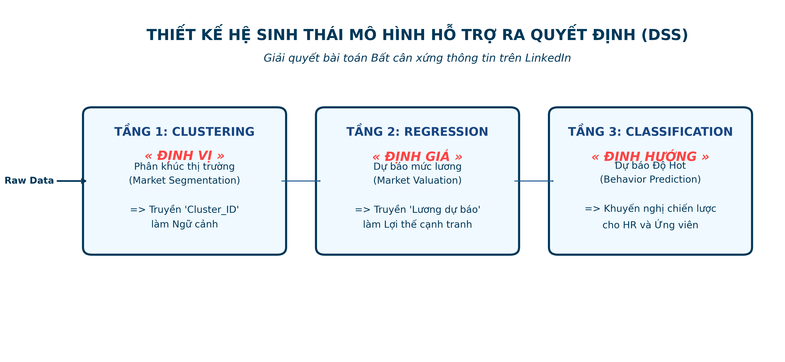
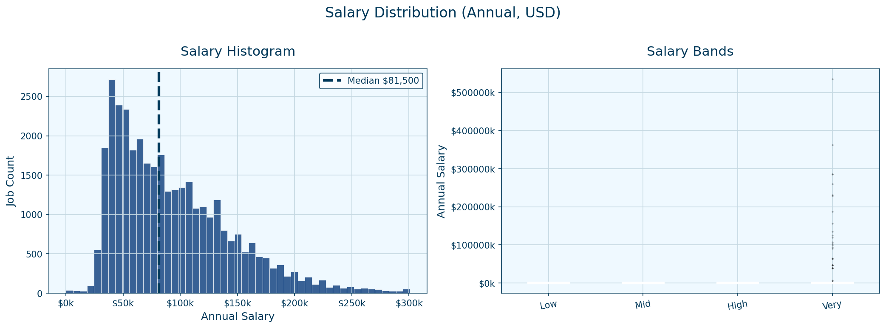
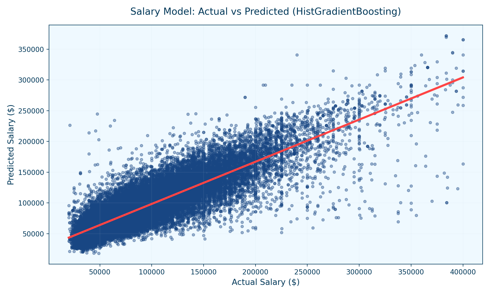

<h1 align="center">📊 LinkedIn Job Market Analytics & AI Predictor</h1>

<div align="center">
  <i>Giải mã sự bất cân xứng thông tin trên thị trường lao động bằng Data Science & Machine Learning</i>
</div>

<br>

<div align="center">
  
  
  
  
  
</div>

---

## 📌 Tổng quan dự án (Project Overview)
Dự án phân tích chuyên sâu **123,000+ tin tuyển dụng** từ LinkedIn. Điểm nhấn lớn nhất của dự án là việc xử lý bài toán **"Bất cân xứng thông tin" (Information Asymmetry)** khi có tới 70% tin tuyển dụng trên thị trường hiện nay đang giấu mức lương thực tế.

Thông qua hệ sinh thái AI hỗ trợ ra quyết định đa tầng (Clustering -> Regression -> Classification), dự án giúp:
- **Ứng viên**: Nắm bắt chính xác 'điểm ngọt' của thị trường và định giá được năng lực thực tế của bản thân.
- **Nhà tuyển dụng**: Tối ưu hóa tin tuyển dụng để thu hút nhân tài (Predict Hot Jobs).

## 🛠 Công Nghệ Sử Dụng (Tech Stack)
- **Data Processing**: `Pandas`, `NumPy`, `Scikit-Learn` (TF-IDF NLP Pipelines)
- **Machine Learning**: `HistGradientBoosting`, `RandomForest`, `K-Means Clustering`
- **Visualization**: `Matplotlib`, `Seaborn`, `Plotly`, `Power BI`
- **App Deployment**: `Streamlit` AI Dashboard Web App

## 🧠 Kiến Trúc Mô Hình (AI Architecture)
Chúng tôi phát triển một Phễu AI 3 tầng liên kết chặt chẽ để trả lời 3 câu hỏi: **Định Vị - Định Giá - Định Hướng**.
> Mô tả chi tiết: Tầng 1 tự động phân cụm tạo "ngữ cảnh" -> Tầng 2 dự đoán lương dựa vào ngữ cảnh và chức danh (NLP) -> Tầng 3 đánh giá độ "Hot" của công việc.

<div align="center">
  
</div>

## 📈 Kết Quả Phân Tích (Key Insights)

### 1. Nghịch Lý Kỹ Năng (The Skill Paradox)
Phân tích phát hiện hệ số tương quan giữa số lượng kỹ năng và mức lương là **~0 (-0.008)**. Nghĩa là thị trường KHÔNG trả tiền cho sự ôm đồm số lượng kỹ năng, mà trả tiền cho **Độ quý hiếm (Niche)** của kỹ năng đó.
<div align="center">
  
</div>

### 2. Định Giá Lương Thành Công
Mô hình `HistGradientBoosting` được chọn làm Champion Model với độ giải thích **R² = 0.60**, giảm mạnh những sai lệch lớn (Outliers) và giúp người dùng dự báo lương chính xác hơn $2000-$4000/tin so với các phương pháp ngẫu nhiên.
<div align="center">
  
</div>

## 📂 Nguồn dữ liệu (Dataset)
- Dữ liệu thô gốc lấy từ nền tảng Kaggle/LinkedIn Data (Dataset dung lượng lớn, >3.3M dòng).
- Quá trình ETL phức tạp bao gồm xử lý N/A, Row Explosion, và xây dựng mô hình Star Schema.
- *(Do dung lượng lớn, Raw data và Processed data không được up trực tiếp lên Repo. Bạn có thể sử dụng ETL Scripts để generate ra file từ nguồn).*

## 🚀 Trải nghiệm Ứng dụng AI (Streamlit App Demo)
Dự án được đóng gói thành một giao diện **Web App trực quan**:
1. Đảm bảo bạn đã cài `requirements.txt`.
2. Mở terminal và chạy lệnh:
   ```bash
   streamlit run app.py
   ```
3. Khám phá Market Trends và công cụ dự báo **AI Salary Estimator** ở địa chỉ `http://localhost:8501`.

---

## 🚀 Hướng dẫn Chạy Ứng dụng

### 1. Chạy dưới máy cục bộ (Local)
Dành cho buổi thuyết trình để đảm bảo tốc độ và sự ổn định:
```bash
# Di chuyển vào thư mục dự án
cd linkedin_jobs_github_repo

# Cài đặt thư viện
pip install -r requirements.txt

# Khởi chạy App
streamlit run app.py
```

### 2. Triển khai lên Web (Streamlit Cloud)
Để chia sẻ dự án cho mọi người truy cập qua Internet:
1.  Đăng nhập vào [Streamlit Cloud](https://share.streamlit.io/) bằng tài khoản GitHub.
2.  Nhấn **Create app** -> Chọn Repository này.
3.  Tại mục **Main file path**, nhập: `app.py`.
4.  Nhấn **Deploy** và đợi 1-2 phút để hệ thống khởi tao môi trường.

---
*Dự án Đồ Án Tốt Nghiệp / Portfolio Chuyên Khoa Data Analytics*
